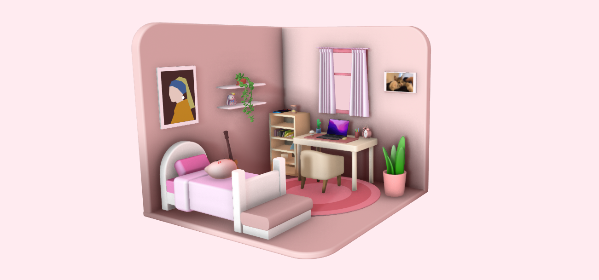

  

  <h3 align="center">limbo</h3>

  

    a 3D immersive experience that blend aesthetics and utility.
     
    <a href="https://github.com/hiidonuts/limbo"><strong>explore the docs»</strong></a>
     
     
    <a href="https://github.com/hiidonuts/limbo">View Demo</a>
    &middot;
    <a href="https://github.com/hiidonuts/limbo/issues/new?template=bug_report.md">report bug</a>
    &middot;
    <a href="https://github.com/hiidonuts/limbo/issues/new?template=feature-request-✨.md">request feature</a>
  

<!-- TABLE OF CONTENTS -->

  
table of contents

  <ol>
    <li>
      <a href="#about-the-project">about the project</a>
      <ul>
        <li><a href="#built-with">built with</a></li>
      </ul>
    </li>
    <li>
      <a href="#getting-started">getting started</a>
      <ul>
        <li><a href="#prerequisites">prerequisites</a></li>
      </ul>
    </li>
    <li><a href="#usage">usage</a></li>
    <li><a href="#roadmap">roadmap</a></li>
    <li><a href="#contributing">contributing</a></li>
    <li><a href="#license">license</a></li>
    <li><a href="#contact">contact</a></li>
    <li><a href="#acknowledgments">acknowledgments</a></li>
  </ol>

<!-- ABOUT THE PROJECT -->
## About The Project

Limbo is a personal project to showcase 3D designs
